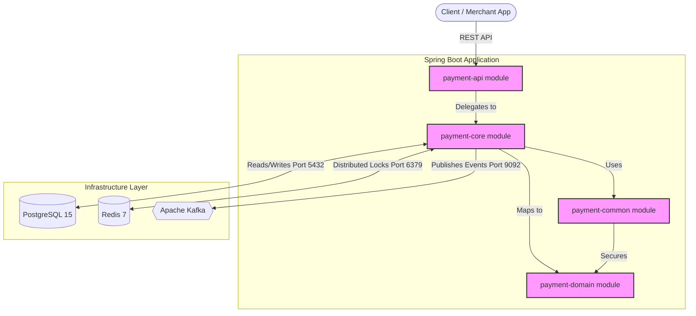
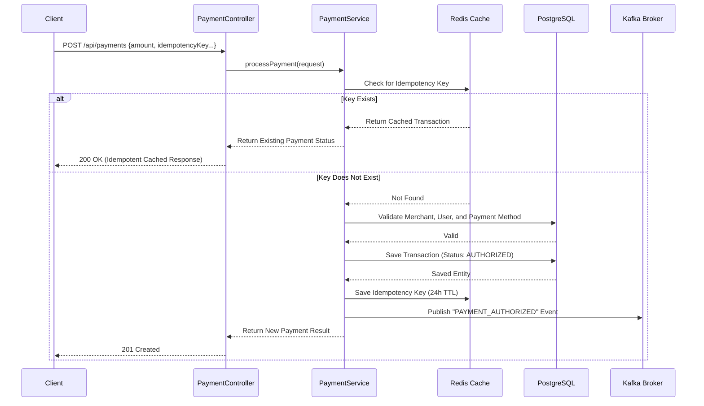
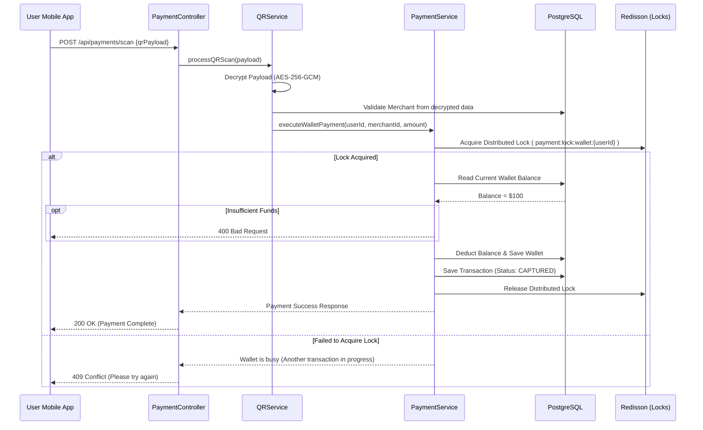
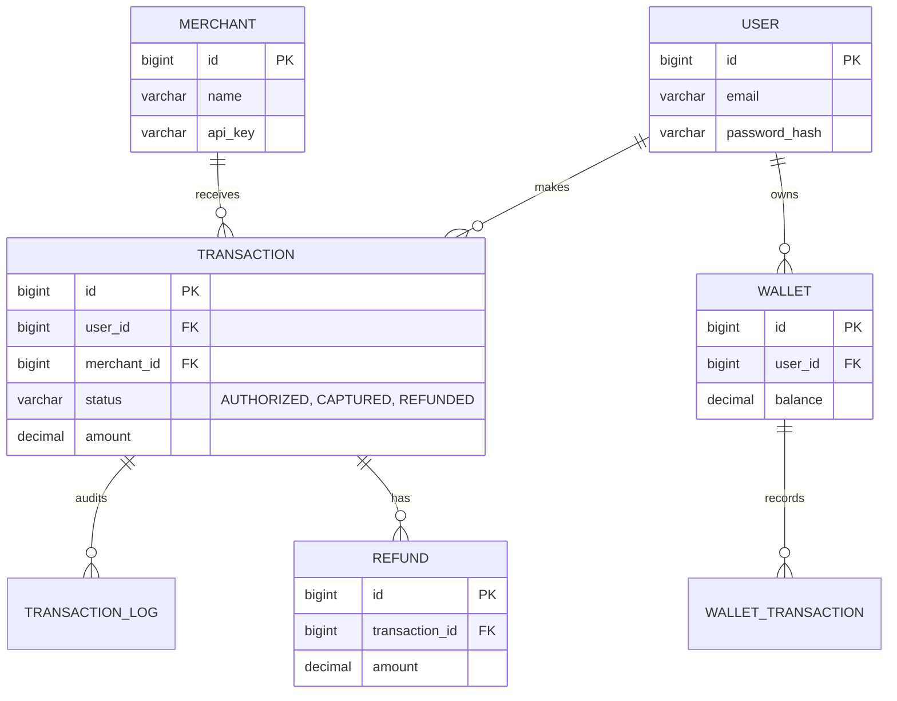

# KimPay Payment Gateway - Architecture & Technical Documentation

Welcome to the detailed architectural documentation for the **KimPay Payment Gateway**. This document is designed to give you a deep physical and logical understanding of the repository's architecture, data flows, and module structure using visual diagrams and clear explanations.

## 🏗️ 1. Architecture Overview

KimPay is an enterprise-grade payment gateway built on **Java 21**, **Spring Boot 3.5.7**, **PostgreSQL**, **Redis**, and **Kafka**. It prevents race conditions and handles idempotency through distributed locking and caching.

### Module Breakdown

- **`payment-api`**: The Spring Boot application entry point. Contains HTTP REST Controllers, authentication/security configuration, and environment setup.
- **`payment-core`**: The brain of the application. Contains all core business logic (Services like `PaymentService`, `QRService`), data access layer (Repositories), and infrastructure interactions (Redis Cache, Redisson Locks, Kafka Events).
- **`payment-domain`**: The data modeling layer. Contains JPA Entities (e.g., `Transaction`, `Wallet`) and Enums representing system state. It has NO dependencies on other internal modules to maintain a clean domain.
- **`payment-common`**: Shared utilities like `EncryptionService` (AES-256-GCM) and QR code generation tools. Used by both `api` and `core` modules.

### High-Level System Architecture



---

## 🔄 2. Transaction Flows (Sequence Diagrams)

### Flow A: Creating & Authorizing a Payment

This is the standard flow when a user attempts to make a payment to a merchant. It showcases the **idempotency** mechanism, which prevents double-charging users if a network request is duplicated quickly.



### Flow B: QR Code Scanning & Wallet Deduction

This flow handles scanning an encrypted merchant QR code and debitting a user's wallet. It uses distributed locking to prevent **race conditions** when concurrent transactions hit the same wallet.



---

## 🗄️ 3. Database Architecture & Schema

The system uses **PostgreSQL**, with schemas managed by **Flyway** (`V1__initial_schema.sql`). Below is the core Entity Relationship for the transaction domain:



**Key Data Design Features:**
1. **Audit Logs:** Every transaction lifecycle change produces an immutable `TRANSACTION_LOG` entry.
2. **Partial Refunds:** `REFUND` allows cumulative refund tracking on a `CAPTURED` transaction up to the original amount.
3. **Database Constraints:** High-cardinality foreign keys and statuses are indexed for fast querying.

---

## 🛡️ 4. Security & Infrastructure Details (Deep Dive)

The KimPay platform leverages advanced infrastructural components to ensure data integrity, speed, and safety in a high-transactions-per-second (TPS) distributed environment.

### 1. Data Encryption (Cryptography)
All sensitive data (e.g., bank accounts, routing numbers, and QR Payloads) is encrypted using **AES-256-GCM** (Advanced Encryption Standard in Galois/Counter Mode) via the internal `EncryptionService`. 
- **Keys & Initialization:** It uses a 256-bit symmetric key (`PAYMENT_ENCRYPTION_KEY_BASE64`), a 12-byte secure random Initialization Vector (IV), and a 128-bit authentication tag.
- **Implementation:** The service generates a new `SecureRandom` IV for every encryption request. The IV is prepended to the ciphertext, enabling the `EncryptedStringConverter` JPA attribute converter to transparently encrypt/decrypt database fields. This guarantees that even if the Postgres database is compromised, PII and financial tokens remain secure.
- **Selectable key provider:** the data-encryption key source is switchable via `payment.encryption.key-provider` — `env` (default, Base64 key from configuration) for local/single-host, `kms` for shared/deployed environments — with no code change.

### 1a. Phase 1 Security Foundation (Authentication, Signing, Authorization)

KimPay enforces a stateless, defense-in-depth request pipeline. Full details and a worked `curl` example live in [`docs/security/authentication.md`](docs/security/authentication.md).

- **Filter chain order:** `ApiKeyAuthFilter` → `RequestSignatureFilter` → controller. Sessions are stateless (no cookie, no CSRF flow). All endpoints require authentication except `/actuator/health` and `/actuator/info`.
- **API-key authentication:** merchants present `Authorization: Bearer <keyId>:<secret>`. The key ID is stored in plaintext; the secret is stored **only as a BCrypt hash** and shown once at issuance. On success the context holds a `MerchantPrincipal(merchantId, keyId)` with `ROLE_MERCHANT`.
- **Request signing (mutating methods):** every non-safe request carries `X-Kimpay-Timestamp`, `X-Kimpay-Nonce`, and `X-Kimpay-Signature`. The RSA `SHA256withRSA` signature is computed over the canonical string `method + "." + requestURI + "." + timestamp + "." + nonce + "." + base64(sha256(body))`, binding method, path, and body together. Verified against the merchant's stored X.509 RSA public key.
- **Replay protection:** a ±300s timestamp window plus a single-use nonce recorded in Redis (`payment:nonce:<keyId>:<nonce>`, atomic `SET ... NX`, TTL 600s). The nonce is registered **only after** the signature verifies, so a forged request cannot burn a victim's nonce.
- **Object-level authorization:** `AuthorizationGuard` checks `MerchantPrincipal.merchantId` against each resource's owner; cross-tenant access returns **404** to avoid leaking resource existence.
- **Non-leaking errors:** all failures return only `{ code, message }` (`server.error.include-message: never`); stack traces, SQL, and other tenants' IDs are never exposed.

### 1b. PSP Adapter (Phase 2a)

Card payments flow through a transport-agnostic **`PspConnector`** seam (in `payment-core`, mirroring the `PaymentEventPublisher` pattern) so the gateway is not coupled to any single acquirer.

- **Interface:** `authorize`, `capture`, `voidAuthorization`, `refund` — returning a normalized `PspResult(status, pspReference, declineReason)`. Implementations must never log PAN/CVV/secret material.
- **Default implementation:** `MockAcquirerConnector`, a deterministic offline connector registered as a `@Bean` with `@ConditionalOnMissingBean`. It approves by default and declines any amount whose minor units equal `.01`, so decline paths are testable without a real acquirer (CI stays green with no external SDK). A real `StripeConnector` (test mode), property-selectable, arrives in Phase 2b.
- **Routing:** **wallet-backed** transactions (`Transaction.walletId != null`) use the internal ledger (Redisson + pessimistic DB lock); **card-backed** transactions route authorize/capture/void/refund through the connector.
- **Lifecycle context:** `Transaction` persists `wallet_id` and `psp_reference` (Flyway `V4`). This lets a separated (authorize-then-capture) flow find the wallet to debit or the PSP reference to capture — closing the previously-deferred manual-capture gap — and `psp_reference` is the key for reconciling inbound PSP webhooks (Phase 2b).

### 1c. QPS / Throughput Hardening (Phase 3a)

Two overload-protection layers, neither of which can compromise money-correctness.

- **Per-API-key rate limiting:** a `RateLimitFilter` (registered **after** `RequestSignatureFilter`, so the authenticated `MerchantPrincipal.keyId()` keys the bucket) uses **Bucket4j** token buckets over a **Redisson** distributed proxy manager, so limits hold across nodes. Buckets are keyed `payment:ratelimit:key:{keyId}`; tunables (`capacity`, `refill-tokens`, `refill-period`, per-key `overrides`) bind from `payment.ratelimit.*`. Over-limit → **HTTP 429** with the `{ "code": "SEC-002" }` envelope and a `Retry-After` header. **Fails open:** if the Redis backend is unreachable the filter allows the request (WARN log) rather than returning 5xx — the DB pessimistic row locks still guarantee zero overdraft / double-charge, so only abuse-protection (not correctness) degrades during a Redis outage. Public paths (`/actuator/health`, `/actuator/info`, `/api/webhooks/psp`) are exempt.
- **PSP circuit breaker + timeout:** a `ResilientPspConnector` decorator (the `@Primary` `PspConnector`, wrapping a delegate bean named `pspDelegate`) applies **Resilience4j** `CircuitBreaker` + `TimeLimiter` (on a bounded executor) around every PSP call. Tunables bind from `payment.psp.resilience.*`. When the breaker is **OPEN** or a call times out, it throws `PspUnavailableException`, mapped by `ApiExceptionHandler` to **HTTP 503** with `{ "code": "NET-003" }` and `Retry-After` — a graceful "try again later" that holds no request thread and leaks no stack trace.
- **Out of scope (3a):** the k6/Gatling load-test proof of the 1,000 TPS / p99 < 250 ms SLO is deferred to the Phase 3c QA slice.

### 2. Event-Driven Architecture (Apache Kafka)
To keep the primary API fast, synchronous operations are restricted to critical validations and database commits. Post-transaction workloads are handled asynchronously via Kafka.
- **Publisher:** `KafkaPaymentEventPublisher` uses Spring's `KafkaTemplate` to serialize `PaymentEvent` objects to JSON using Jackson.
- **Topics & Keys:** Events are broadcasted to the topic defined in `PAYMENT_KAFKA_TOPIC` (default: `payment.events`). The `transactionId` acts as the Kafka message key, guaranteeing that all events for a specific transaction (e.g., `AUTHORIZED` -> `CAPTURED` -> `REFUNDED`) are routed to the same Kafka partition, thus preserving strict chronological order for downstream consumers.
- **Consumers:** External microservices (like Email/SMS Notification Services, Accounting Ledgers, or Fraud Analysis tools) consume these events independently without affecting the payment gateway's performance.

**Example Usage**:
```java
// Spring Boot publishes the payment status asynchronously via KafkaTemplate
paymentEventPublisher.publish(new PaymentEvent(
    "CAPTURED", 
    transaction.getId(), 
    transaction.getUserId(), 
    transaction.getMerchantId(), 
    transaction.getAmount(), 
    transaction.getCurrency(), 
    transaction.getStatus(), 
    "Payment captured successfully", 
    LocalDateTime.now()
));
```

### 3. Memory & High-TPS Utilities (Redis)
KimPay utilizes Redis 7 for high-speed, volatile data management across two primary domains:

**A. Distributed Caching (StringRedisTemplate)**
- **Merchant Validation:** To prevent overwhelming PostgreSQL during high traffic, merchant existence is cached under `payment:merchant:exists:{merchantId}` with a 1-hour TTL.

**Example Usage (Merchant Cache)**:
```java
String merchantCacheKey = "payment:merchant:exists:" + request.merchantId();
if (Boolean.FALSE.equals(redisTemplate.hasKey(merchantCacheKey))) {
    if (!merchantRepository.existsById(request.merchantId())) {
        throw new IllegalArgumentException("Merchant not found");
    }
    // High TPS save: Caches merchant in memory for 1 Hour
    redisTemplate.opsForValue().set(merchantCacheKey, "active", 1, TimeUnit.HOURS);
}
```

**B. Idempotency Checks (StringRedisTemplate & Redisson)**
- **Idempotency Logic:** Duplicate `POST` requests are caught by searching for `payment:idempotency:{idempotencyKey}`. If a match is found, the system immediately returns the cached transaction, shielding the database from double charges. We secure the idempotency check itself using a Redisson Distributed Lock.

**Example Usage (Idempotency Key & Redis Lock)**:
```java
// 1. Client passes "idempotencyKey" header or body payload (e.g. "order-UUID-123")
String idempotencyKey = request.idempotencyKey();

// 2. We acquire a distributed lock specific to THIS key to block simultaneous duplicated clicks
RLock lock = redissonClient.getLock("payment:lock:idempotency:" + idempotencyKey);
if (lock.tryLock(5, 10, TimeUnit.SECONDS)) {
    try {
        String redisKey = "payment:idempotency:" + idempotencyKey;
        // 3. System checks Redis Cache directly
        if (Boolean.TRUE.equals(redisTemplate.hasKey(redisKey))) {
            // Already processed! Return earlier cached transaction from DB immediately
            return transactionRepository.findByIdempotencyKey(idempotencyKey).get();
        }
        
        // 4. If new, run standard logic and cache key afterwards for 24 Hours
        PaymentResponse response = processCreatePayment(request);
        redisTemplate.opsForValue().set(redisKey, "completed", 24, TimeUnit.HOURS);
        return response;
    } finally {
        lock.unlock(); // 5. Release Lock across JVM nodes
    }
}
```

**C. Distributed Locking (Redisson)**
- **Race Condition Prevention:** Standard PostgreSQL pessimistic locking (`SELECT ... FOR UPDATE`) is heavily supplemented by **Redisson**, a distributed Java Redis client.
- **Wallet Protection:** When executing a wallet debit, `PaymentService` attempts to acquire a Redisson lock: `payment:lock:wallet:{walletId}` with a strict 10-second lease time and a 5-second wait time. This establishes a cross-JVM thread-safe environment, ensuring that a user double-tapping a "Pay" button doesn't accidentally overdraft their wallet across two different load-balanced Spring Boot instances.

### 4. High Concurrency & High TPS Handling Strategy
When the platform is subjected to flash sales or sudden surges in payment attempts (High Transactions-Per-Second), the system is designed to gracefully absorb the load rather than crashing. KimPay handles concurrency through multiple architectural mechanisms:

**A. Asynchronous Offloading**
- During a high-TPS event, the API prevents JVM threads from acting on slow, blocking operations like sending emails or writing audit logs. By publishing to **Kafka**, the API simply commits the core transaction to PostgreSQL and immediately returns a `200 OK` or `201 Created` to the client. The surrounding heavy-lifting is executed later by Kafka consumers, keeping Tomcat thread pools open.

**B. Database Connection Pooling**
- Found in `application.yml`, the system relies on **HikariCP** (a blazing-fast JDBC connection pool). The pool strictly manages a minimum of 5 and a maximum of 10 connections per JVM instance, ensuring the underlying PostgreSQL database doesn't suffer from connection exhaustion during a traffic spike.
- Combined with `batch_size: 20` defined in hibernate properties, bulk processes are batched and executed optimally.

**C. Redis Memory Shifting**
- As showcased above, operations like validating a merchant or retrieving idempotency limits are entirely offloaded to **Redis** (which operates completely in RAM, responding in sub-milliseconds). This drops the number of queries reaching the PostgreSQL database by roughly 50% per payment attempt, providing the database breathing room to handle the actual insertions.

**D. Concurrency Thread Safety**
- Concurrency fundamentally risks "Race Conditions" where two HTTP threads attempt to subtract from the same balance simultaneously. 
- The system handles this via a two-layer defense mechanism: 
  1. **Application Layer (Fast):** Redisson locks (e.g. `payment:lock:wallet:123`) enforce a strict single-file line across all application nodes.
  2. **Database Layer (Absolute):** Even if the cache fails, queries execute `SELECT ... FOR UPDATE`, forcing PostgreSQL to apply a pessimistic row-level lock. Only one transaction is allowed to deduct balance at any absolute millisecond.
