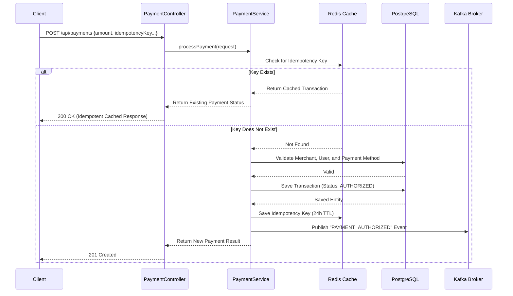
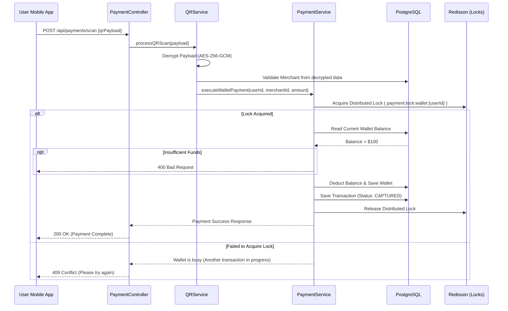
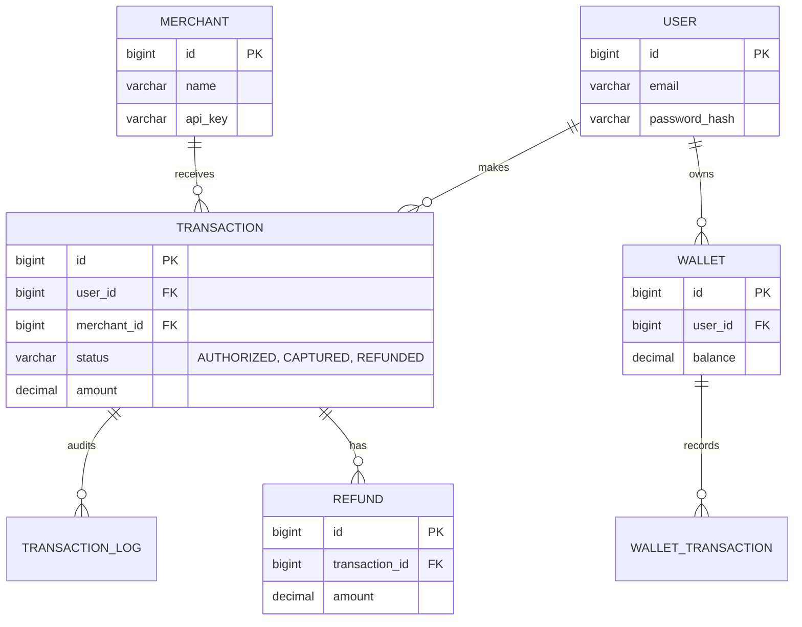

# KimPay Payment Gateway - Architecture & Technical Documentation

Welcome to the detailed architectural documentation for the **KimPay Payment Gateway**. This document is designed to give you a deep physical and logical understanding of the repository's architecture, data flows, and module structure using visual diagrams and clear explanations.

## 🏗️ 1. Architecture Overview

KimPay is an enterprise-grade payment gateway built on **Java 21**, **Spring Boot 3.5.7**, **PostgreSQL**, **Redis**, and **Kafka**. It prevents race conditions and handles idempotency through distributed locking and caching.

### Module Breakdown

- **`payment-api`**: The Spring Boot application entry point. Contains HTTP REST Controllers, authentication/security configuration, and environment setup.
- **`payment-core`**: The brain of the application. Contains all core business logic (Services like `PaymentService`, `QRService`), data access layer (Repositories), and infrastructure interactions (Redis Cache, Redisson Locks, Kafka Events).
- **`payment-domain`**: The data modeling layer. Contains JPA Entities (e.g., `Transaction`, `Wallet`) and Enums representing system state. It has NO dependencies on other internal modules to maintain a clean domain.
- **`payment-common`**: Shared utilities like `EncryptionService` (AES-256-GCM) and QR code generation tools. Used by both `api` and `core` modules.

### High-Level System Architecture

---

## 🔄 2. Transaction Flows (Sequence Diagrams)

### Flow A: Creating & Authorizing a Payment

This is the standard flow when a user attempts to make a payment to a merchant. It showcases the **idempotency** mechanism, which prevents double-charging users if a network request is duplicated quickly.

### Flow B: QR Code Scanning & Wallet Deduction

This flow handles scanning an encrypted merchant QR code and debitting a user's wallet. It uses distributed locking to prevent **race conditions** when concurrent transactions hit the same wallet.

---

## 🗄️ 3. Database Architecture & Schema

The system uses **PostgreSQL**, with schemas managed by **Flyway** (`V1__initial_schema.sql`). Below is the core Entity Relationship for the transaction domain:

**Key Data Design Features:**
1. **Audit Logs:** Every transaction lifecycle change produces an immutable `TRANSACTION_LOG` entry.
2. **Partial Refunds:** `REFUND` allows cumulative refund tracking on a `CAPTURED` transaction up to the original amount.
3. **Database Constraints:** High-cardinality foreign keys and statuses are indexed for fast querying.

---

## 🛡️ 4. Security & Infrastructure Details

### 1. Data Encryption (AES-256-GCM)
The `payment-common` module provides the `EncryptionService` to handle `AES-256-GCM` encryption. It uses JPA attribute converters (like `EncryptedStringConverter`) to automatically encrypt/decrypt sensitive fields (like bank accounts or routing numbers) transparently before saving to PostgreSQL.
- **Key Source:** Managed via the `PAYMENT_ENCRYPTION_KEY_BASE64` environment variable.

### 2. Concurrency & Race Conditions (Redisson Distributed Locks)
Wallet balances and critical state changes are protected by **Redisson Distributed Locks**. Since the application is designed to scale horizontally across multiple instances, standard database locking isn't enough. Redis locks (`payment:lock:wallet:{userId}`) ensure only one thread across the entire cluster can modify a user's wallet at any given moment.

### 3. High-TPS Optimization (Redis Caching)
Merchant validation occurs on nearly every transaction route. To avoid continuously hitting the PostgreSQL database during high Transactions Per Second (TPS) events, the `payment-core` caches merchant existence in Redis (`payment:merchant:exists:{id}`) with a 1-hour TTL.

### 4. Event-Driven Architecture (Kafka)
Immediate operations (like DB saves and idempotent checks) happen synchronously. Post-transaction operations are handled asynchronously. `payment-core` publishes events (e.g., `PAYMENT_CAPTURED`, `PAYMENT_REFUNDED`) to **Apache Kafka**, allowing downstream independent microservices (e.g., email service, analytics, accounting ledger) to react.
