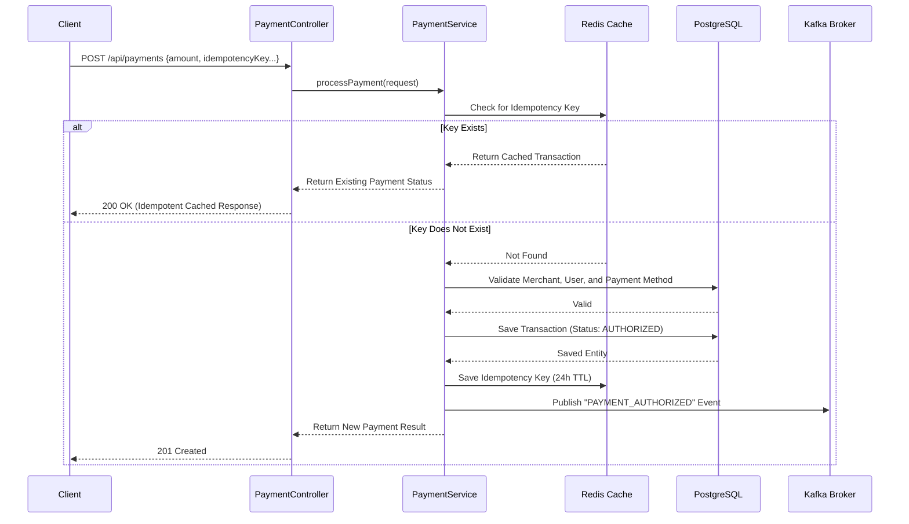
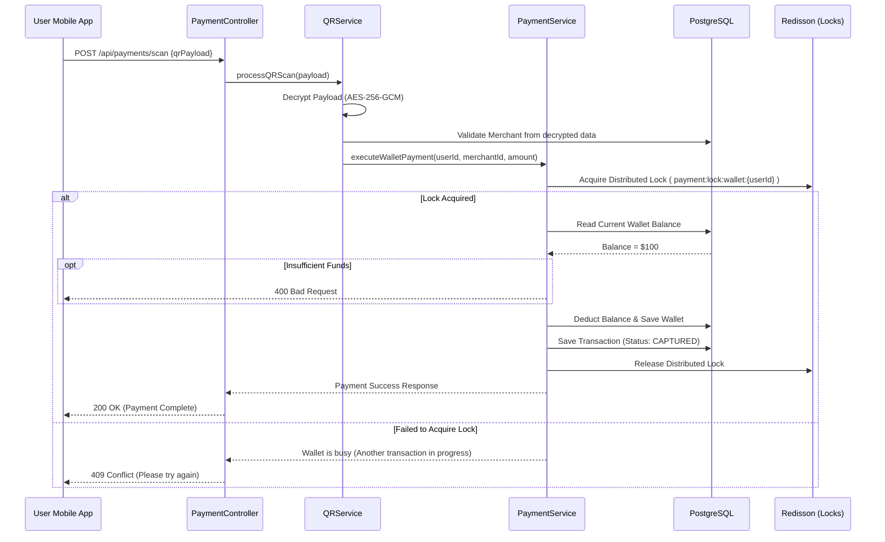
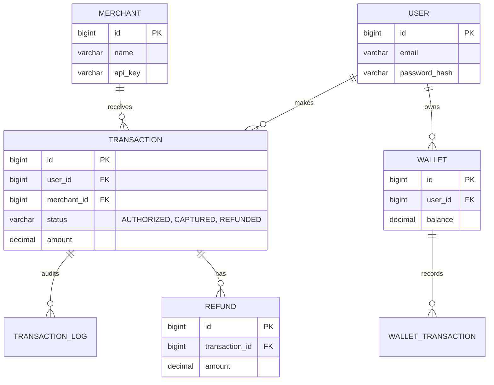

# KimPay Payment Gateway - Architecture & Technical Documentation

Welcome to the detailed architectural documentation for the **KimPay Payment Gateway**. This document is designed to give you a deep physical and logical understanding of the repository's architecture, data flows, and module structure using visual diagrams and clear explanations.

## 🏗️ 1. Architecture Overview

KimPay is an enterprise-grade payment gateway built on **Java 21**, **Spring Boot 3.5.7**, **PostgreSQL**, **Redis**, and **Kafka**. It prevents race conditions and handles idempotency through distributed locking and caching.

### Module Breakdown

- **`payment-api`**: The Spring Boot application entry point. Contains HTTP REST Controllers, authentication/security configuration, and environment setup.
- **`payment-core`**: The brain of the application. Contains all core business logic (Services like `PaymentService`, `QRService`), data access layer (Repositories), and infrastructure interactions (Redis Cache, Redisson Locks, Kafka Events).
- **`payment-domain`**: The data modeling layer. Contains JPA Entities (e.g., `Transaction`, `Wallet`) and Enums representing system state. It has NO dependencies on other internal modules to maintain a clean domain.
- **`payment-common`**: Shared utilities like `EncryptionService` (AES-256-GCM) and QR code generation tools. Used by both `api` and `core` modules.

### High-Level System Architecture

---

## 🔄 2. Transaction Flows (Sequence Diagrams)

### Flow A: Creating & Authorizing a Payment

This is the standard flow when a user attempts to make a payment to a merchant. It showcases the **idempotency** mechanism, which prevents double-charging users if a network request is duplicated quickly.

### Flow B: QR Code Scanning & Wallet Deduction

This flow handles scanning an encrypted merchant QR code and debitting a user's wallet. It uses distributed locking to prevent **race conditions** when concurrent transactions hit the same wallet.

---

## 🗄️ 3. Database Architecture & Schema

The system uses **PostgreSQL**, with schemas managed by **Flyway** (`V1__initial_schema.sql`). Below is the core Entity Relationship for the transaction domain:

**Key Data Design Features:**
1. **Audit Logs:** Every transaction lifecycle change produces an immutable `TRANSACTION_LOG` entry.
2. **Partial Refunds:** `REFUND` allows cumulative refund tracking on a `CAPTURED` transaction up to the original amount.
3. **Database Constraints:** High-cardinality foreign keys and statuses are indexed for fast querying.

---

## 🛡️ 4. Security & Infrastructure Details (Deep Dive)

The KimPay platform leverages advanced infrastructural components to ensure data integrity, speed, and safety in a high-transactions-per-second (TPS) distributed environment.

### 1. Data Encryption (Cryptography)
All sensitive data (e.g., bank accounts, routing numbers, and QR Payloads) is encrypted using **AES-256-GCM** (Advanced Encryption Standard in Galois/Counter Mode) via the internal `EncryptionService`. 
- **Keys & Initialization:** It uses a 256-bit symmetric key (`PAYMENT_ENCRYPTION_KEY_BASE64`), a 12-byte secure random Initialization Vector (IV), and a 128-bit authentication tag.
- **Implementation:** The service generates a new `SecureRandom` IV for every encryption request. The IV is prepended to the ciphertext, enabling the `EncryptedStringConverter` JPA attribute converter to transparently encrypt/decrypt database fields. This guarantees that even if the Postgres database is compromised, PII and financial tokens remain secure.

### 2. Event-Driven Architecture (Apache Kafka)
To keep the primary API fast, synchronous operations are restricted to critical validations and database commits. Post-transaction workloads are handled asynchronously via Kafka.
- **Publisher:** `KafkaPaymentEventPublisher` uses Spring's `KafkaTemplate` to serialize `PaymentEvent` objects to JSON using Jackson.
- **Topics & Keys:** Events are broadcasted to the topic defined in `PAYMENT_KAFKA_TOPIC` (default: `payment.events`). The `transactionId` acts as the Kafka message key, guaranteeing that all events for a specific transaction (e.g., `AUTHORIZED` -> `CAPTURED` -> `REFUNDED`) are routed to the same Kafka partition, thus preserving strict chronological order for downstream consumers.
- **Consumers:** External microservices (like Email/SMS Notification Services, Accounting Ledgers, or Fraud Analysis tools) consume these events independently without affecting the payment gateway's performance.

### 3. Memory & High-TPS Utilities (Redis)
KimPay utilizes Redis 7 for high-speed, volatile data management across two primary domains:

**A. Distributed Caching (StringRedisTemplate)**
- **Merchant Validation:** To prevent overwhelming PostgreSQL during high traffic, merchant existence is cached under `payment:merchant:exists:{merchantId}` with a 1-hour TTL.
- **Idempotency Checks:** Duplicate `POST` requests are caught by searching for `payment:idempotency:{idempotencyKey}`. If a match is found, the system immediately returns the cached transaction, shielding the database from duplicate inserts.

**B. Distributed Locking (Redisson)**
- **Race Condition Prevention:** Standard PostgreSQL pessimistic locking (`SELECT ... FOR UPDATE`) is heavily supplemented by **Redisson**, a distributed Java Redis client.
- **Wallet Protection:** When executing a wallet debit, `PaymentService` attempts to acquire a Redisson lock: `payment:lock:wallet:{walletId}` with a strict 10-second lease time and a 5-second wait time. This establishes a cross-JVM thread-safe environment, ensuring that a user double-tapping a "Pay" button doesn't accidentally overdraft their wallet across two different load-balanced Spring Boot instances.
