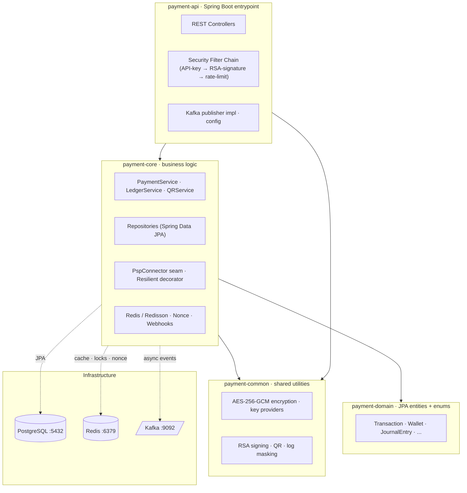
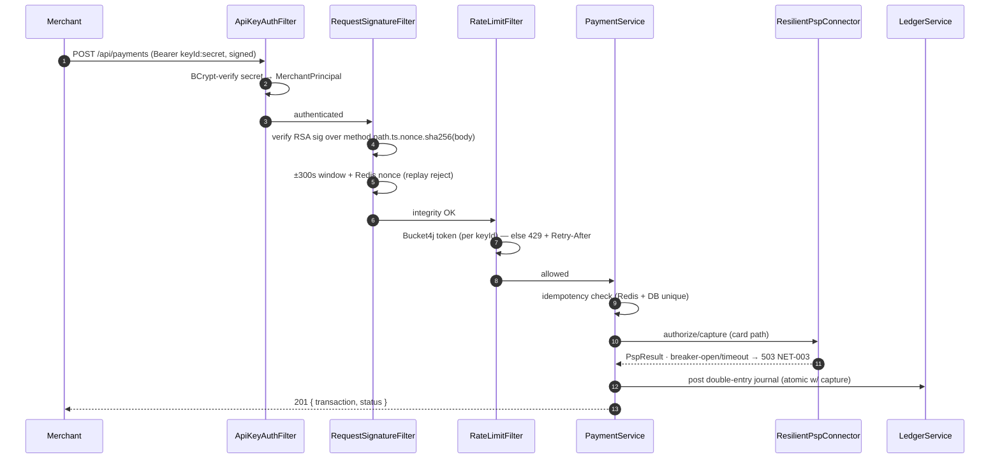

<div align="center">

# 💳 KimPay Payment Gateway

**A security-first, money-correct payment gateway — production-shaped architecture, sandbox-grade integrations.**

Stateless API-key + RSA request signing · double-entry ledger · distributed idempotency · circuit-broken PSP calls · signed webhooks · per-key rate limiting.

[](https://openjdk.org/)
[](https://spring.io/projects/spring-boot)
[](https://www.postgresql.org/)
[](https://redis.io/)
[](https://kafka.apache.org/)
[](https://resilience4j.readme.io/)
[](#-testing)
[](LICENSE)

</div>

> [!IMPORTANT]
> **KimPay is sandbox-grade.** It uses production-shaped architecture and security, integrated with payment rails in **test/sandbox mode only — no live money moves.** It targets SAQ-A *posture* (never stores PANs) but is **not** PCI-DSS certified. Treat it as a reference-grade engineering project, not a live acquirer.

---

## Table of Contents

- [Why KimPay](#-why-kimpay)
- [Architecture](#-architecture)
- [Request Lifecycle](#-request-lifecycle)
- [Security Model](#-security-model)
- [Money Correctness](#-money-correctness)
- [Resilience & Throughput](#-resilience--throughput)
- [Feature Matrix](#-feature-matrix)
- [Tech Stack](#-tech-stack)
- [Project Structure](#-project-structure)
- [Quick Start](#-quick-start)
- [Configuration](#-configuration)
- [API Reference](#-api-reference)
- [Error Contract](#-error-contract)
- [Database Schema](#-database-schema)
- [Testing](#-testing)
- [CI/CD & Deployment](#-cicd--deployment)
- [Roadmap](#-roadmap)
- [License](#-license)

---

## 🎯 Why KimPay

KimPay handles the full transaction lifecycle — authorize → capture → void → (partial) refund, plus wallet and QR payments — on a clean **multi-module Maven** codebase with hard boundaries between API, business logic, domain, and shared crypto.

What makes it interesting:

- 🔐 **No unauthenticated surface.** Every mutating request is authenticated (BCrypt-hashed API secret), **RSA-signed**, and **replay-protected** (nonce + timestamp window) before it touches a controller.
- 🧮 **Provable money-correctness.** A **double-entry ledger** records every movement; `trialBalance()` holds (Σdebits == Σcredits). Wallet debits are guarded by **two independent layers** (distributed lock *and* DB row lock) — zero overdraft, zero double-charge under concurrency.
- ♻️ **Idempotent by construction.** Redis-backed idempotency keys with a DB unique constraint as the source of truth — replays never double-charge.
- ⚡ **Degrades gracefully.** PSP calls are wrapped in **circuit breakers + timeouts**; per-API-key **rate limiting** sheds load with `429 + Retry-After`. A Redis outage fails *open* on throttling but never compromises ledger correctness.
- 📡 **Webhooks both ways.** Verifies inbound PSP webhooks (HMAC-SHA256) and delivers **signed, retried, dead-letterable** outbound webhooks to merchants.

---

## 🏗️ Architecture

Strict, inward-pointing module dependencies keep the core transport-agnostic and testable.



**Dependency rule:** dependencies point inward/downward only — `domain` and `common` never depend on `core`. Cross-module collaboration (e.g. `PaymentEventPublisher`, `PspConnector`) goes through interfaces in `core`, with implementations in `api`. Optional infrastructure has `@ConditionalOnMissingBean` fallbacks, so the context boots without Kafka/Redis/PSP.

---

## 🔄 Request Lifecycle

A signed, money-moving request flows through the filter chain before any business logic runs:



> Wallet-backed payments take the internal ledger path (Redisson lock + pessimistic DB lock); card-backed payments route through the `PspConnector`.

---

## 🔐 Security Model

| Layer | Implementation |
|---|---|
| **Authentication** | `Authorization: Bearer <keyId>:<secret>`. The secret is stored **only** as a BCrypt hash and shown once at issuance — never retrievable. |
| **Request integrity** | RSA signature over the canonical string `method.path.timestamp.nonce.base64(sha256(body))`, verified against the merchant's stored public key. Enforced for all non-safe methods. |
| **Replay protection** | Mandatory `X-Kimpay-Nonce` (single-use, Redis-tracked) + `X-Kimpay-Timestamp` (±300s window). |
| **Encryption at rest** | AES-256-GCM via `EncryptedStringConverter` for bank accounts, webhook secrets, QR payloads. Versioned ciphertext supports key rotation. |
| **Key management** | Selectable provider (`payment.encryption.key-provider` = `env` \| `kms`). Use KMS in any shared environment. |
| **Authorization** | Object-level: a merchant may only act on its own resources. Ownership mismatches return `404` (no enumeration oracle). |
| **No data leakage** | Errors return only `{ code, message }` — never stack traces, SQL, or cross-tenant IDs. Sensitive strings routed through `SensitiveDataMasker`; logback masks at the appender as defense-in-depth. |
| **PCI posture** | PANs are never stored — tokenized via the PSP. SAQ-A *posture*, documented scope. |

**Signing headers (mutating requests):**

```http
Authorization:        Bearer pk_live_xxx:sk_live_xxx
X-Kimpay-Timestamp:   1716800000
X-Kimpay-Nonce:       3f9c1e2a-...-unique
X-Kimpay-Signature:   <base64 RSA-SHA256 of canonical string>
```

📄 Full scheme: [`docs/security/authentication.md`](docs/security/authentication.md).

---

## 🧮 Money Correctness

**Two-layer concurrency defense** — never rely on a single layer for financial mutations:

1. **Application (fast):** Redisson distributed locks (`payment:lock:wallet:{id}`, `payment:lock:idempotency:{key}`) serialize across nodes with bounded wait + lease.
2. **Database (absolute):** pessimistic row locks (`SELECT ... FOR UPDATE`) guarantee correctness even if the cache fails.

**Double-entry ledger** (`LedgerAccount` / `JournalEntry` / `JournalLine`): every capture and refund posts a balanced journal *inside the same transaction* as the money movement. Accounts are per-owner (`WALLET:{id}`, `MERCHANT:{id}`) or system singletons (`SYS:PSP_CLEARING`, `SYS:FEE_REVENUE`, `SYS:GATEWAY_CASH`). Balances lock in id-sorted order (deadlock-safe). `trialBalance()` is true iff global debits == credits — the basis for any future reconciliation/settlement job.

**Idempotency:** every payment-create accepts an `idempotencyKey`, cached in Redis (24h TTL) and backed by a DB unique constraint as the source of truth — duplicates are rejected under concurrency.

---

## ⚡ Resilience & Throughput

| Concern | Mechanism | Behavior |
|---|---|---|
| **PSP instability** | Resilience4j `CircuitBreaker` + `TimeLimiter` around every `PspConnector` call (via the `@Primary` `ResilientPspConnector` decorator) | Breaker-open / timeout → `503` + `Retry-After` + `NET-003`. No request thread held, no stack-trace leak. |
| **Overload / abuse** | Per-API-key Bucket4j token buckets over a Redisson distributed proxy (`RateLimitFilter`) | Over-limit → `429` + `Retry-After` + `SEC-002`, with `X-RateLimit-Remaining`. Limits hold cluster-wide. |
| **Redis outage** | Rate-limit filter **fails open** | Requests proceed (WARN logged); DB row locks still guarantee zero overdraft/double-charge, so only abuse-protection degrades. |
| **Async offloading** | Kafka for notifications/audit fan-out | Publishing is non-blocking and never fails the core transaction. |

**Targets (SLOs):** sustained ~1,000 TPS on payment-create, gateway-internal p99 < 250 ms (excluding upstream PSP), 100% concurrency correctness, graceful degradation when Redis/PSP are down. *(Load-test proof is tracked in the QA phase — see [Roadmap](#-roadmap).)*

---

## ✨ Feature Matrix

| Domain | Capabilities |
|---|---|
| **Payments** | Create & authorize, deferred capture, void, full/partial refund, get, list by user/merchant |
| **Wallets** | Debit/credit with two-layer locking; balance integrity under concurrency |
| **QR payments** | Encrypted merchant QR generation (Base64 image) + scan-to-pay |
| **Ledger** | Double-entry journals, materialized account balances, trial balance |
| **PSP adapter** | Pluggable `PspConnector` seam; deterministic `MockAcquirerConnector` for offline/CI; circuit-broken & timed |
| **Webhooks (inbound)** | `POST /api/webhooks/psp` — HMAC-SHA256 verified, ±300s window, two-layer idempotency, reconciles transaction state |
| **Webhooks (outbound)** | Merchant endpoint registration (HTTPS-only, secret encrypted & shown once), signed delivery, exponential backoff, dead-letter after 5 attempts |
| **Security** | API-key + RSA signing + replay protection, AES-256-GCM at rest, object-level authz |
| **Throughput** | Per-key rate limiting, PSP circuit breakers/timeouts |
| **Events** | Kafka payment lifecycle events (`AUTHORIZED`, `CAPTURED`, `FAILED`, `REFUNDED`) |
| **Schema** | Flyway-managed (`V1`–`V7`), validate-on-startup in prod |

---

## 🛠️ Tech Stack

| Layer | Technology |
|---|---|
| Language / Framework | **Java 17**, Spring Boot **3.5.7** (Web MVC, Security, Data JPA, Kafka, Data Redis) |
| Database | PostgreSQL 15 · Flyway migrations · Hibernate (tests run on H2 in PostgreSQL mode) |
| Cache / Locks | Redis 7 + Redisson 3.45 (idempotency, merchant cache, distributed locks, nonce store) |
| Messaging | Apache Kafka (Confluent 7.4) — async payment events, `transactionId` partition key |
| Crypto | AES-256-GCM (field encryption), RSA SHA-256 (request signing), HMAC-SHA256 (webhooks) |
| Resilience | Resilience4j 2.3 (circuit breaker + time limiter) |
| Rate limiting | Bucket4j 8.14 (JDK17 build) over Redisson |
| QR | ZXing 3.5 |
| Build | Maven (multi-module) via `./mvnw` wrapper |
| Testing | JUnit 5, Mockito, AssertJ, MockMvc, WireMock |
| Ops | Docker + `docker-compose`, GitHub Actions |

---

## 📁 Project Structure

```
PaymentGateway/
├── payment-api/        # Spring Boot app: controllers, security filter chain, config, Kafka impl
│   └── src/main/resources/db/migration/   # Flyway V1..V7
├── payment-core/       # Services, repositories, PSP seam, ledger, webhooks, Redis/Redisson
├── payment-domain/     # JPA entities + status enums (no Spring logic)
├── payment-common/     # AES-256-GCM, RSA signing, QR, key providers, log masking
├── docs/               # architecture, security/authentication, decision log, phase specs & plans
├── docker-compose.yml  # Local Postgres + Redis + Kafka
├── run.ps1 / run.bat   # One-command local startup
└── mvnw / mvnw.cmd     # Maven wrapper
```

---

## 🚀 Quick Start

### Prerequisites

| Tool | Version |
|---|---|
| JDK | 17+ |
| Docker Desktop | latest (for local Postgres/Redis/Kafka) |
| Maven | 3.9+ (or use the bundled `./mvnw`) |

### One command (recommended)

Spins up infrastructure, builds, and launches the app:

```powershell
.\run.ps1        # PowerShell (Windows)
```
```cmd
run.bat          :: Command Prompt
```

### Manual

```bash
# 1. Start infrastructure
docker compose up -d

# 2. Build
./mvnw clean package -DskipTests

# 3. Configure (example values — generate your own key!)
export SPRING_DATASOURCE_URL=jdbc:postgresql://localhost:5432/payment_gateway
export SPRING_DATASOURCE_USERNAME=postgres
export SPRING_DATASOURCE_PASSWORD=admin
export REDIS_HOST=localhost
export KAFKA_BOOTSTRAP_SERVERS=localhost:9092
export PAYMENT_ENCRYPTION_KEY_BASE64="$(openssl rand -base64 32)"

# 4. Run
java -jar payment-api/target/payment-api-0.0.1-SNAPSHOT.jar
```

**Health check:**
```bash
curl http://localhost:8080/actuator/health
```

---

## ⚙️ Configuration

Configuration lives in `payment-api/src/main/resources/application.yml`, driven by environment variables.

| Variable | Default | Description |
|---|---|---|
| `SPRING_DATASOURCE_URL` | — | JDBC connection string |
| `SPRING_DATASOURCE_USERNAME` / `_PASSWORD` | `postgres` / — | DB credentials |
| `REDIS_HOST` / `REDIS_PORT` | `localhost` / `6379` | Redis connection |
| `KAFKA_BOOTSTRAP_SERVERS` | `localhost:9092` | Kafka brokers |
| `PAYMENT_KAFKA_ENABLED` | `true` | Toggle Kafka publishing (off → no-op fallback) |
| `PAYMENT_ENCRYPTION_KEY_BASE64` | — | Base64 32-byte AES key (**required**, never commit) |
| `PAYMENT_KEY_PROVIDER` | `env` | Encryption key provider: `env` \| `kms` |
| `PSP_WEBHOOK_SECRET` | — | Shared secret for inbound PSP webhook HMAC (fail-fast if blank) |
| `payment.ratelimit.capacity` / `.refill-tokens` / `.refill-period` | `100` / `50` / `1s` | Per-key token bucket |
| `payment.psp.resilience.*` | see yml | Breaker thresholds, timeout, open-state wait |
| `FLYWAY_ENABLED` | `true` | Toggle migrations |
| `PORT` | `8080` | HTTP port |

> [!WARNING]
> Generate the encryption key with `openssl rand -base64 32` and inject it via environment/KMS. Never use a hard-coded or committed key outside local development.

---

## 📡 API Reference

Base URL: `http://localhost:8080` · All bodies are JSON · Amounts are decimal, currency is ISO-4217 (uppercase).

### Payments — `/api/payments`

| Method | Endpoint | Description |
|---|---|---|
| `POST` | `/api/payments` | Create & authorize a payment (optionally auto-capture) |
| `GET` | `/api/payments/{transactionId}` | Get a payment |
| `POST` | `/api/payments/{transactionId}/capture` | Capture an authorized payment |
| `POST` | `/api/payments/{transactionId}/void` | Void an authorized payment |
| `POST` | `/api/payments/{transactionId}/refund` | Refund a captured payment (partial supported) |
| `GET` | `/api/payments/user/{userId}` | List a user's payments |
| `GET` | `/api/payments/merchant/{merchantId}` | List a merchant's payments |
| `GET` | `/api/payments/merchant/{merchantId}/qr?amount=&currency=` | Generate an encrypted merchant QR (Base64 image) |
| `POST` | `/api/payments/scan` | Process a QR scan and execute payment |

### Webhooks

| Method | Endpoint | Auth | Description |
|---|---|---|---|
| `POST` | `/api/webhooks/psp` | HMAC (PSP secret) | Inbound PSP event — verifies signature, reconciles state |
| `POST` | `/api/webhook-endpoints` | merchant-signed | Register an outbound webhook endpoint (HTTPS-only) |
| `GET` | `/api/webhook-endpoints` | merchant-signed | List endpoints (secret omitted) |
| `DELETE` | `/api/webhook-endpoints/{id}` | merchant-signed | Remove an endpoint |

### Example — create payment

```json
POST /api/payments
{
  "userId": 1,
  "merchantId": 2,
  "paymentMethodId": 3,
  "walletId": null,
  "amount": 99.99,
  "currency": "USD",
  "capture": true,
  "idempotencyKey": "order-abc-123"
}
```

```json
201 Created
{ "transactionId": 1001, "status": "CAPTURED", "amount": 99.99, "currency": "USD" }
```

---

## 🚨 Error Contract

Every error returns the same envelope — no internals leak:

```json
{ "code": "SEC-002", "message": "Rate limit exceeded" }
```

| Code | HTTP | Meaning |
|---|---|---|
| `REQ-001` | 400 | Invalid request data |
| `AUTH-001` | 401 | Unauthorized |
| `SEC-001` | 401 | Signature verification failed |
| `SEC-002` | 429 | Rate limit exceeded (`Retry-After` set) |
| `RES-404` | 404 | Resource not found / not yours |
| `PAY-003` | 409 | Insufficient funds |
| `PAY-004` | 409 | Duplicate transaction |
| `NET-003` | 503 | PSP temporarily unavailable (breaker open / timeout; `Retry-After` set) |

Codes are defined in the `ErrorCode` enum (`payment-common`) — never ad-hoc strings.

---

## 🗄️ Database Schema

PostgreSQL-flavored schema managed by **Flyway** (`payment-api/src/main/resources/db/migration/`), validated against entity mappings on startup in prod.

| Migration | Adds |
|---|---|
| `V1__initial_schema` | Core schema (users, merchants, wallets, transactions, refunds, currencies, …) + seed data |
| `V2__add_merchant_public_key` | Merchant RSA public key (request signing) |
| `V3__add_api_credentials` | API key credentials (BCrypt-hashed secret, prefix-indexed) |
| `V4__add_transaction_wallet_and_psp_ref` | `wallet_id` + `psp_reference` on transactions (deferred capture, reconciliation) |
| `V5__add_ledger` | Double-entry ledger: accounts, journal entries, journal lines |
| `V6__psp_webhook_events` | Inbound PSP webhook event log (idempotency unique constraint) |
| `V7__webhook_tables` | Outbound webhook endpoints + delivery rows |

High-cardinality FKs and status/`created_at` columns are indexed. Invariants (unique idempotency key, FKs, NOT NULL) are enforced in-schema, not just in application code.

---

## 🧪 Testing

TDD is the default; the pyramid runs unit → slice → integration → end-to-end.

```bash
./mvnw test                                            # all modules
./mvnw -pl payment-core -am test                       # one module
./mvnw -pl payment-core -am test -Dtest=ApiKeyServiceTest   # one class
./mvnw clean verify                                    # with coverage
```

Coverage is exercised across concurrency/idempotency (parallel double-spend, duplicate keys, replayed nonces), money correctness (refund bounds, ledger balance), security (auth required, signature/replay rejection, no leakage), and failure paths (PSP/Redis down → graceful degradation). New security behavior is tested **with filters enabled**; an end-to-end `SecuredPaymentE2ETest` exercises the full signed flow plus tamper/replay rejection.

---

## 🔁 CI/CD & Deployment

**GitHub Actions** (`.github/workflows/ci-cd.yml`) builds, tests, and (on `main`) builds the `payment-api` Docker image and uploads JAR artifacts.

```bash
# Build the API image
docker build -t kimpay/payment-api:latest -f payment-api/Dockerfile .

# Production JAR
./mvnw clean package -DskipTests
java -jar payment-api/target/payment-api-0.0.1-SNAPSHOT.jar --spring.profiles.active=production
```

Required production env: `SPRING_DATASOURCE_URL`, `SPRING_DATASOURCE_PASSWORD`, `REDIS_HOST`, `KAFKA_BOOTSTRAP_SERVERS`, `PAYMENT_ENCRYPTION_KEY_BASE64` (preferably via KMS), `PSP_WEBHOOK_SECRET`.

---

## 🗺️ Roadmap

KimPay is built in spec-driven phases (`docs/superpowers/`), each with its own design → plan → implementation.

| Phase | Scope | Status |
|---|---|---|
| **1 — Security Foundation** | Stateless auth, API keys, RSA signing, replay protection, key management, input hardening | ✅ Complete |
| **2a — PSP Adapter** | Pluggable `PspConnector` seam, deterministic mock, lifecycle context | ✅ Complete |
| **2b — Ledger** | Double-entry ledger, balanced journals, trial balance | ✅ Complete |
| **2c — Webhooks** | Inbound PSP (HMAC) + outbound merchant (signed, retried, DLQ) | ✅ Complete |
| **3a — QPS / Throughput** | Per-key rate limiting, PSP circuit breakers + timeouts | ✅ Complete |
| **3b — CI/CD pipeline** | Testcontainers, SAST/dependency/secret scanning, image scan, gated deploy | 📋 Planned |
| **3c — Full QA** | Load/soak/spike + chaos, contract tests, SLO proof | 📋 Planned |
| **3d — Observability** | Micrometer/Prometheus, OpenTelemetry tracing, SLO alerting, audit trail | 📋 Planned |

---

## 📝 License

© 2026 KimPay Technologies. All Rights Reserved.

Unauthorized copying, modification, distribution, or disclosure of this project, via any medium, is strictly prohibited. This repository contains proprietary and confidential information.

<div align="center">

**Built with a security-first, money-correct mindset.**

</div>
